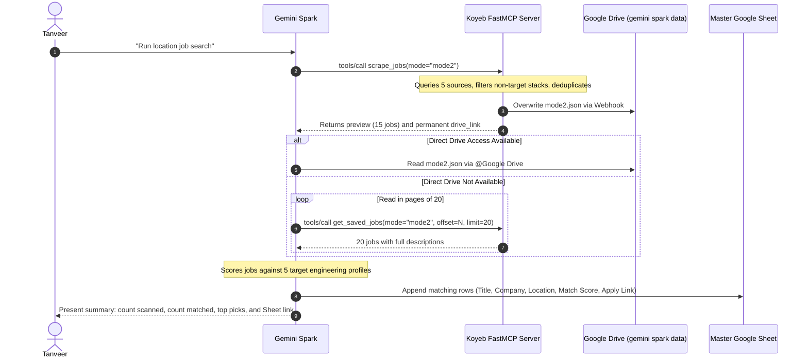

# Job Scraper MCP Server — AI Client and Automation Specification

Authoritative operating guide for AI clients (Gemini Spark, Claude, Cursor, ChatGPT) connecting to the Job Scraper FastMCP server. This document defines the wire protocol, server endpoints, tool signatures, parameter passing, and data persistence contracts.

---

## 1. Server Topology and Connection Details

- Protocol: Model Context Protocol (MCP) over Streamable HTTP (`streamable-http`)
- Transport Wire Format: JSON-RPC 2.0
- Live Production URL: `https://wet-canid-tanveer-rajpurohit-a1f979e3.koyeb.app/mcp`
- Healthcheck URL: `https://wet-canid-tanveer-rajpurohit-a1f979e3.koyeb.app/health`
- Root Ping URL: `https://wet-canid-tanveer-rajpurohit-a1f979e3.koyeb.app/`
- Host: Koyeb (Cloudflare Edge, Frankfurt datacenter)
- Deployment: Automated continuous deployment on `git push origin main`

### Client Configuration (mcpServers format)

To connect an AI client to this server, register it in your client configuration:

```json
{
  "mcpServers": {
    "job-scraper": {
      "url": "https://wet-canid-tanveer-rajpurohit-a1f979e3.koyeb.app/mcp",
      "transport": "streamable-http"
    }
  }
}
```

---

## 2. How MCP Works Under the Hood

The Model Context Protocol connects language models to external tools through standard JSON-RPC 2.0 messages over HTTP POST.

### Step 1: Handshake (initialize)
When the AI client boots, it establishes a session with the server:

```http
POST /mcp HTTP/1.1
Host: wet-canid-tanveer-rajpurohit-a1f979e3.koyeb.app
Content-Type: application/json
Accept: application/json, text/event-stream

{
  "jsonrpc": "2.0",
  "id": 1,
  "method": "initialize",
  "params": {
    "protocolVersion": "2024-11-05",
    "capabilities": {},
    "clientInfo": {
      "name": "gemini-spark",
      "version": "1.0.0"
    }
  }
}
```

The server returns its capabilities and assigns a unique session ID in the `mcp-session-id` header:

```http
HTTP/1.1 200 OK
Content-Type: application/json
mcp-session-id: 0a30207494104662bb6a5082b2f4d188

{
  "jsonrpc": "2.0",
  "id": 1,
  "result": {
    "protocolVersion": "2024-11-05",
    "capabilities": {
      "tools": { "listChanged": false },
      "resources": { "listChanged": false, "subscribe": false }
    },
    "serverInfo": {
      "name": "job-scraper",
      "version": ""
    }
  }
}
```

### Step 2: Tool Discovery (tools/list)
The client queries available tools:

```json
{
  "jsonrpc": "2.0",
  "id": 2,
  "method": "tools/list",
  "params": {}
}
```

The server responds with the schema of all registered tools, their parameters, and documentation.

### Step 3: Tool Execution (tools/call)
When the model decides to run a tool, the client dispatches:

```json
{
  "jsonrpc": "2.0",
  "id": 3,
  "method": "tools/call",
  "params": {
    "name": "scrape_jobs",
    "arguments": {
      "mode": "mode2"
    }
  }
}
```

The server runs the scraper, writes the output to disk, uploads to Google Drive, and returns the result.

---

## 3. Tool Reference and Parameter Passing

An AI client can invoke the scrapers in two ways: through the unified `scrape_jobs` dispatcher or through direct dedicated functions.

### Primary Tool: scrape_jobs (Unified Dispatcher)

The unified tool allows the AI to select the execution target by passing the `mode` parameter.

- Tool Name: `scrape_jobs`
- Argument: `mode` (string, optional, default: `"mode2"`)

| Mode Value | What it Runs | Output File | Target Audience & Scope |
|---|---|---|---|
| `"mode1"` (or `"india_all"`) | Pan-India Sweep | `mode1.json` | National technical sweep across 13 engineering keywords for 2027 graduates. |
| `"mode2"` (or `"location"`) | Location Sweep *(Default)* | `mode2.json` | Gujarat top priority (Ahmedabad, Gandhinagar, Vadodara) plus Tier-1 metros (Delhi NCR, Mumbai, Pune). Rejects non-target cities. |
| `"mode3"` (or `"remote"`) | Remote Sweep | `mode3.json` | 100% remote software engineering positions open to Indian applicants. |

#### AI Client Call Payloads:

1. Running Mode 1 (Pan-India sweep):
```json
{
  "name": "scrape_jobs",
  "arguments": {
    "mode": "mode1"
  }
}
```

2. Running Mode 2 (Location sweep with Gujarat priority — Recommended daily default):
```json
{
  "name": "scrape_jobs",
  "arguments": {
    "mode": "mode2"
  }
}
```

3. Running Mode 3 (Remote sweep):
```json
{
  "name": "scrape_jobs",
  "arguments": {
    "mode": "mode3"
  }
}
```

---

### Dedicated Direct Tools (Zero Arguments)

Clients that prefer invoking direct functions without passing arguments can call these endpoints directly:

| Tool Name | Arguments | Equivalent Dispatcher Call | Target Output |
|---|---|---|---|
| `scrape_jobs_india_location` | None (`dummy=""`) | `scrape_jobs(mode="mode2")` | `data/mode2.json` + Drive |
| `scrape_jobs_india_all` | None (`dummy=""`) | `scrape_jobs(mode="mode1")` | `data/mode1.json` + Drive |
| `scrape_jobs_remote` | None (`dummy=""`) | `scrape_jobs(mode="mode3")` | `data/mode3.json` + Drive |

---

### Reader Tool: get_saved_jobs (Batch Pagination)

Because a full scrape produces 100 to 300+ jobs with long descriptions (~1.5 MB payload), returning all descriptions in one tool response would blow out the model's context window. 

The `get_saved_jobs` tool lets the AI read full descriptions in small, token-safe pages:

- Tool Name: `get_saved_jobs`
- Arguments:
  - `mode`: `"mode1"`, `"mode2"`, or `"mode3"` (default: `"mode2"`)
  - `offset`: Starting row index, 0-indexed (default: `0`)
  - `limit`: Number of jobs per page (default: `20`, max: `50`)

Example call to inspect the second page of Mode 2 jobs:
```json
{
  "name": "get_saved_jobs",
  "arguments": {
    "mode": "mode2",
    "offset": 20,
    "limit": 20
  }
}
```

---

### MCP Resource Endpoint: jobs://{mode}

The server also exposes data files as MCP resources:
- URI: `jobs://mode1`
- URI: `jobs://mode2`
- URI: `jobs://mode3`

AI environments that support MCP resources can read the raw JSON string directly without executing a tool call.

---

## 4. Response Payload Schema

Every scraper execution returns a structured JSON dictionary:

```json
{
  "status": "success",
  "mode": "mode2",
  "total_jobs": 124,
  "drive_link": "https://drive.google.com/file/d/1wgzCY_E0h34-hXEpir8Fgdev4Uyil1AG/view?usp=drivesdk",
  "file_saved": "mode2.json",
  "drive": {
    "status": "success",
    "file_name": "mode2.json",
    "drive_link": "https://drive.google.com/file/d/1wgzCY_E0h34-hXEpir8Fgdev4Uyil1AG/view?usp=drivesdk",
    "file_id": "1wgzCY_E0h34-hXEpir8Fgdev4Uyil1AG"
  },
  "preview_count": 15,
  "preview_jobs": [
    {
      "id": "f594d82697f57aa3",
      "source": "jobspy",
      "title": "Software Engineer Intern",
      "company": "Crest Data Systems",
      "location": "Ahmedabad, Gujarat",
      "date_posted": "2026-09-09",
      "job_type": "fulltime",
      "is_remote": false,
      "salary": "",
      "apply_link": "https://www.linkedin.com/jobs/view/...",
      "job_link": "https://www.linkedin.com/jobs/view/..."
    }
  ],
  "has_more": true,
  "errors": [],
  "note": "Preview shows top 15 of 124 jobs. Full dataset saved to mode2.json and uploaded to Google Drive. Retrieve full records in token-safe batches via get_saved_jobs(mode='mode2', offset=N, limit=20)."
}
```

---

## 5. Qualification and Filtering Pipeline

The server filters raw job board responses before saving them to disk or Google Drive:

1. Date Freshness Cutoff: Postings older than 96 hours (3 to 4 days) are discarded.
2. Technology Blacklist: Postings with the following stacks in their title are rejected:
   - PHP, Laravel, CodeIgniter, Symfony
   - .NET, Dotnet, ASP.NET, C#
   - Android, iOS, Flutter, Swift, Kotlin, React Native, Mobile Developer
   - Salesforce, SAP, Oracle Cloud HCM, WordPress, Magento, Shopify
3. Seniority Filtering:
   - Explicit senior titles (Senior, Sr., Lead, Staff, Principal, Architect, Director, Manager) are rejected.
   - Postings requiring 3 or more years of experience are dropped unless explicitly identified as an entry-level or intern role.
   - Member of Technical Staff (MTS-1, AMTS) and Associate Software Engineer titles are accepted.
4. Deduplication:
   - A 16-character SHA-256 hash is generated from normalized `title|company|link`. Postings appearing on multiple boards (e.g. LinkedIn and Indeed) resolve to a single record.

---

## 6. Gemini Spark End-to-End Workflow



---

## 7. Keep-Alive Cron Setup (24/7 Zero Cold Starts)

Koyeb spins down idle free instances after periods of inactivity. To keep the server warm for instant responses:

- Ping URL: `GET https://wet-canid-tanveer-rajpurohit-a1f979e3.koyeb.app/health`
- Schedule: Every 12 minutes on cron-job.org
- Response: `{"status": "healthy", "service": "job-scraper-mcp"}` returned in under 10 milliseconds
- Resource Cost: Does not trigger scraping runs or disk writes
